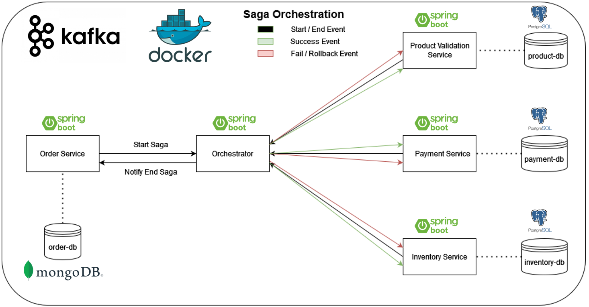

## Serviço de pagamento - Arquitetura Saga Orchestrator

### Descrição
Projeto voltado para estudo da arquitetura saga orchestrator em java.

### Tecnologias

* **Java 17**
* **Spring Boot 3**
* **Apache Kafka**
* **API REST**
* **PostgreSQL**
* **MongoDB**
* **Docker**
* **docker-compose**
* **Redpanda Console**

### Ferramentas utilizadas

* **IntelliJ IDEA Community Edition**
* **Docker**
* **Gradle**